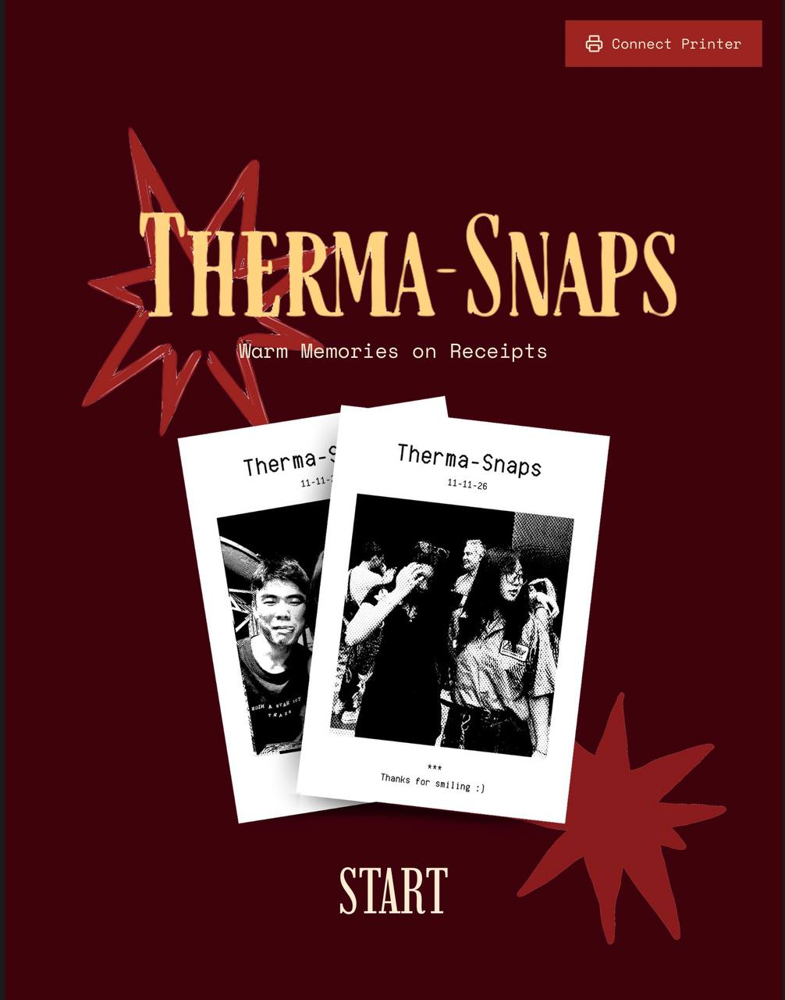
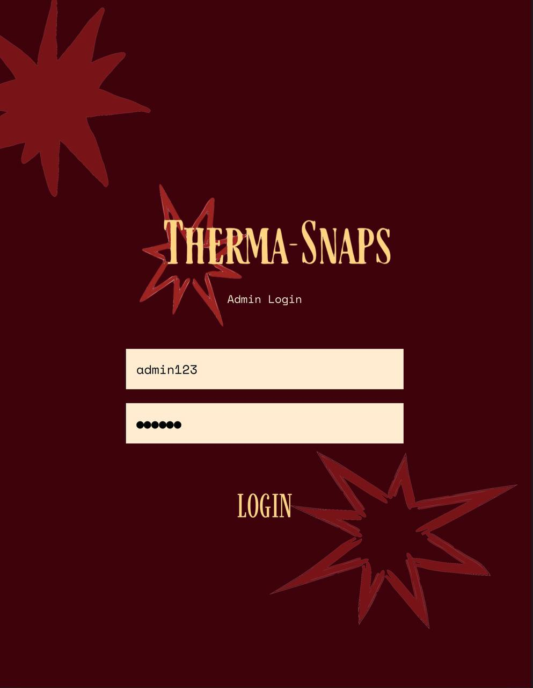
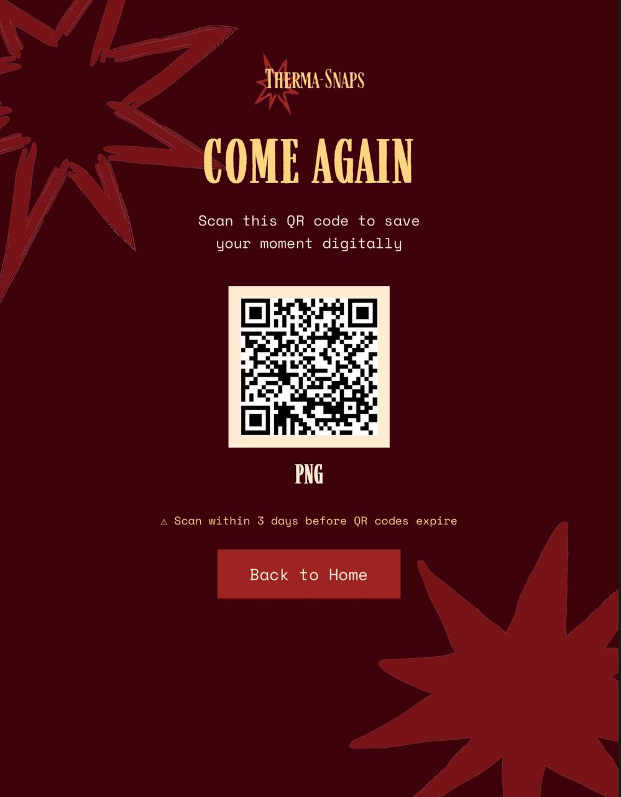

# Therma-Snaps

*Warm Memories on Receipts*

Therma-Snaps is a web-based photobooth application that captures moments and prints them instantly on a thermal receipt printer. Built with React, it leverages the Web Bluetooth API for hardware communication and Supabase for cloud storage, providing both a physical keepsake and a digital backup of your memories.

## Features

*   **Webcam Capture**: Take single or multi-shot photos directly from your browser.
*   **Thermal Printing**: Connect to a compatible thermal printer via Web Bluetooth and print your photo strips.
*   **Custom Layouts**: Choose between different photo strip layouts.
*   **Digital Copies**: Photos are automatically uploaded to a Supabase backend.
*   **QR Code Downloads**: A unique QR code is generated for each session, allowing users to download a digital copy of their photo strip (valid for 3 days).
*   **Admin Panel**: A simple login for the event operator.
*   **Responsive Design**: Optimized for a tablet or kiosk setup.

## Gallery

| Home Screen | Layout Selection |
|:---:|:---:|
|  |  |
| **Camera Capture** | **Print Preview** |
|  |  |

## Tech Stack

*   **Frontend**: React.js
*   **Backend & Storage**: Supabase
*   **Hardware Integration**: Web Bluetooth API
*   **Styling**: Inline CSS & CSS-in-JS

## Getting Started

Follow these instructions to get a local copy up and running.

### Prerequisites

*   Node.js and npm
*   A Supabase account
*   A compatible thermal printer (tested with MP-58A1)

### Installation & Setup

1.  **Clone the repository:**
    ```bash
    git clone https://github.com/acousticsometimes/therma-snaps-photobooth.git
    cd therma-snaps-photobooth
    ```

2.  **Install dependencies:**
    ```bash
    npm install
    ```

3.  **Set up environment variables:**
    Create a `.env` file in the root of the project and add your Supabase credentials. You can get these from your Supabase project's API settings.
    ```env
    REACT_APP_SUPABASE_URL=YOUR_SUPABASE_URL
    REACT_APP_SUPABASE_ANON_KEY=YOUR_SUPABASE_ANON_KEY
    ```

4.  **Set up Supabase:**
    You will need to create a storage bucket named `photos` and a table named `photo_metadata`. You can use the following SQL in the Supabase SQL Editor:
    ```sql
    -- Create the storage bucket for photos
    INSERT INTO storage.buckets (id, name, public)
    VALUES ('photos', 'photos', true)
    ON CONFLICT (id) DO UPDATE SET public = true;

    -- Create a policy to allow public read access to the photos
    CREATE POLICY "Public Read Access" ON storage.objects
    FOR SELECT USING (bucket_id = 'photos');

    -- Create the table to store photo metadata
    CREATE TABLE public.photo_metadata (
      key TEXT PRIMARY KEY,
      value JSONB,
      created_at TIMESTAMPTZ DEFAULT now()
    );
    ```

5.  **Run the application:**
    ```bash
    npm start
    ```
    The app will be available at `http://localhost:3000`.

## Admin Demo

To try out the admin interface, use the following credentials on the login screen:
*   **Username**: `admin123`
*   **Password**: `040404`

## Hardware

This application is designed to work with thermal receipt printers that support the Web Bluetooth API. The development and testing were done using an **MP-58A1** model. Your mileage may vary with other printers, and you might need to adjust the Bluetooth service and characteristic UUIDs in `src/App.js`.

## Deployment

This app can be deployed to any static site hosting service like Vercel, Netlify, or GitHub Pages.

1.  Run `npm run build` to create a production build in the `build/` directory.
2.  Deploy the `build/` folder to your hosting provider.
3.  Remember to configure the environment variables (`REACT_APP_SUPABASE_URL` and `REACT_APP_SUPABASE_ANON_KEY`) in your hosting provider's settings.

## License

This project is licensed under the MIT License. See the LICENSE file for details.
